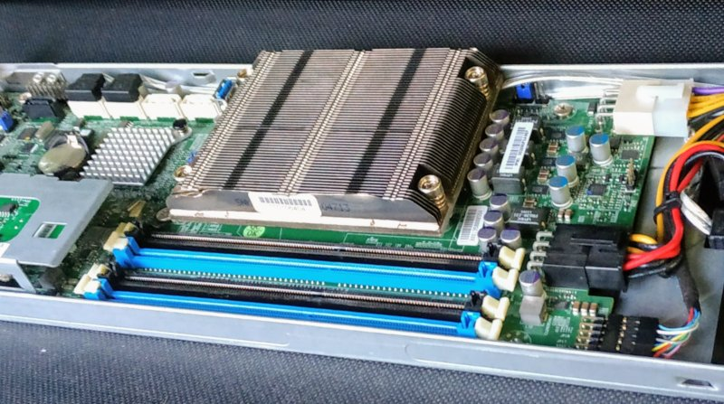

# CPU Cooler solutions for the Supermicro X10SLE-F

Officially the cpu cooler for a X10SLE-F is a very low profile and proprietary [SNK-P0047PSR](https://store.supermicro.com/1u-passive-proprietary-cpu-cooler-snk-p0047psr.html), 
as well as the 
It makes totally sense for Supermicro to recommend only one heat sink, since it needs to fit exactly the small blade, when used in a micro cloud chassis. 
However, since we are trying to use it as a single board and maybe with a custom case, we should figure out alternatives to this cooler. 

## Dimensions of the physical connection to the Board

Screw Distances:
Short side: 56mm 
Long side: 94mm 

This looks very similar to the typcial Supermicro socket 2011 narrow ILM! Thats pretty awesome as we have a broader selection of cooling solutions. 

## Supermicro 2011 Narrow ILM heat sinks 

### Passive Heat sinks
| Case height | Link to Product | Style | Comments | 
| :---: | :---: | :---: | :---: | 
| 1U | [SNK-P0047PSR](https://store.supermicro.com/1u-passive-proprietary-cpu-cooler-snk-p0047psr.html) | Officially the proprietary 1155/1150 heat sink for the X10sle-f | Needs horizontal airflow (small screw side to small screw side) or from above | 
| 1U | [SNK-P0047PS+](https://store.supermicro.com/server-accessories/heatsink/1u-passive-proprietary-cpu-cooler-snk-p0047ps-plus.html) | Officially  the proprietary 1155/1150/1151 heat sink for the X10sle-f | Needs horizontal airflow (small screw side to small screw side) or from above | 
| 1U | [SNK-P0047PS](https://store.supermicro.com/server-accessories/heatsink/1u-passive-cpu-cooler-snk-p0047ps.html) | LGA 2011 narrow ILM heat sink | Needs horizontal airflow (small screw side to small screw side) or from above | 
| 1U | [SNK-P0057PS](https://store.supermicro.com/server-accessories/heatsink/1u-passive-cpu-cooler-snk-p0057ps.html) | a wider and more effect LGA 2011 narrow ILM heat sink | Needs horizontal airflow (small screw side to small screw side) or from above | 
| 1U | [SNK-P0057PSU](https://store.supermicro.com/server-accessories/heatsink/1u-passive-cpu-cooler-snk-p0057psu.html) | a wider and more effect LGA 2011 narrow ILM heat sink (May be too large for the X10SLE-F!!) | Needs horizontal airflow (small screw side to small screw side) or from above | 
| 1U | [Dynatron T318](https://www.dynatron.co/product-page/t318) | Fully Copper based on LGA 2011 narrow ILM | Needs horizontal airflow (small screw side to small screw side) or from above | 
| 1U | [Dynatron T249](https://www.dynatron.co/product-page/t249) | Fully Copper based on LGA 2011 narrow ILM slightly more effective than T318 | Needs horizontal airflow (small screw side to small screw side) or from above | 
| 1U | [Dynatron R31](https://www.dynatron.co/product-page/r31) | Aluminium cooler with copper base plate based on LGA 2011 narrow ILM | Needs horizontal airflow (small screw side to small screw side) or from above | 
| 1U | [CooNong Heat Sink](https://www.aliexpress.com/item/32983980455.html) (Manufactor not found) | Fully Copper heat sink based on LGA 2011 narrow ILM | Needs horizontal airflow (small screw side to small screw side) or from above | 
| 1U | [Fujitsu V26898-B1000-V1](http://manuals.ts.fujitsu.com/illustrated_spares/content/RX2510_M1/detail.htm?id=546) | LGA 2011 narrow ILM heat sink with a covered top | Needs horizontal airflow (small screw side to small screw side)  | 
| 2U | [Dynatron R23](https://www.dynatron.co/product-page/r31) | Aluminium cooler with copper base plate based on LGA 2011 narrow ILM | Needs horizontal airflow (small screw side to small screw side) or from above | 
| 2U | [SNK-P0048PS](https://store.supermicro.com/2u-passive-cpu-cooler-snk-p0048ps.html) | Heat Sink with covered top. | Needs horizontal Airflow (small screw side to small screw side) | 
| 2U | [SNK-P0058PSU](https://store.supermicro.com/server-accessories/heatsink/2u-passive-cpu-cooler-snk-p0058psu.html) | Special stair stile heat hink would allow an offset or angled fan. | Made for horizontal Airflow (small screw side to small screw side) | 
| 4U | [Fujitsu V26898-B1005-V1](http://manuals.ts.fujitsu.com/files/html/primergy/isc/RX2560_M1/detail.htm?id=561) | LGA 2011 narrow ILM Heatpipe tower style heat sink (made by Coolermaster) | Needs horizontal airflow (small screw side to small screw side) | 

### Active cooler with fans:
| Case height | Link to Product | Style | Comments | 
| :---: | :---: | :---: | :---: | 
| 1U | [Dynatron R13](https://www.dynatron.co/product-page/r13) | Active CPU cooling solution with a blower fan for LGA 2011 narrow ILM | Connected 12V via 4 pin PWM with aprox 22 to 59 dbA (based on PWM signal) | 
| 1U | [Dynatron R25](https://www.dynatron.co/product-page/r25) | Active CPU cooling solution with a blower fan for LGA 2011 narrow ILM | Connected 12V via 4 pin PWM with aprox 22 to 59 dbA (based on PWM signal) | 
| 2U | [SNK-P0048AP4](https://store.supermicro.com/2u-active-cpu-cooler-snk-p0048ap4.html) | Active CPU cooling solution with adapter to fit square and narrow ILM | Connected 12V via 4 pin PWM with aprox 52 dbA | 
| 2U | [Dynatron R14](https://www.dynatron.co/product-page/r14) | Active CPU cooling solution with fully copper heat sink for LGA 2011 narrow ILM | Connected 12V via 4 pin PWM with aprox 16 to 47 dbA (based on PWM signal) | 
| 2U | [Dynatron R24](https://www.dynatron.co/product-page/r24) | Active CPU cooling solution with direct attached heat pipes for LGA 2011 narrow ILM | Connected 12V via 4 pin PWM with aprox 16 to 47 dbA (based on PWM signal) | 
| 2U | [CooNong Narrow ILM](https://www.aliexpress.com/item/33006186833.html) (Manufactor not found) | Active CPU cooling Solution with direct attached heat pipes for LGA 2011 narrow ILM with 60mm fan on the side | Connected 12V via 4 pin PWM, aprox. 41 dbA | 
| 2U | [CooNong Narrow ILM](https://www.aliexpress.com/item/32983245396.html) (Manufactor not found) | Active CPU cooling Solution with full copper heat sink and 60mm top fan for LGA 2011 narrow ILM | | 3U | [Dynatron R27](https://www.dynatron.co/product-page/r14) | Active CPU cooling solution with direct attached heat pipes LGA 2011 narrow ILM with an 80mm fan | Connected 12V via 4 pin PWM with aprox 16 to 44 dbA (based on PWM signal) | 
| 3U | [Noctua NH-D9DX-i4](https://noctua.at/en/products/cpu-cooler-workstation-server/nh-d9dx-i4-3u) | Active CPU cooling solution with adapter to fit square and narrow ILM and bases on a 90mm fan | Connected 12V via 4 pin PWM with aprox 16-22 dbA | 
| 3U | [Noctua NH-U9DX-i4](https://noctua.at/en/products/cpu-cooler-workstation-server/nh-u9dx-i4) | Active CPU cooling solution with adapter to fit square and narrow ILM and bases on two 90mm fans | Connected 12V via 4 pin PWM with aprox 13-17 dbA | 
Connected 12V via 4 pin PWM, aprox. 41 dbA | 
| 4U | [SNK-P0050AP4](https://store.supermicro.com/4u-active-cpu-cooler-snk-p0050ap4.html) | Active CPU cooling solution with adapter to fit square and narrow ILM | Connected 12V via 4 pin PWM with aprox 38 dbA | 
| aprox 6U | [Noctua NH-U12DX-i4](https://noctua.at/en/products/cpu-cooler-workstation-server/nh-u12dx-i4) | Active CPU cooling solution with adapter to fit square and narrow ILM and bases on a 120mm fan | Connected 12V via 4 pin PWM with aprox 18-22 dbA, 158mm height - may need more than 5U | 

## Accessories

Upgradekit for [Thermalright coolers](http://www.thermalright.de/en/cooler/) (*) to be able to fit on 2011 Narrow ILM:  http://www.thermalright.de/en/accessories/67/narrow-ilm-kit
(*) Compatbility-exceptions are the "Heatpipe-Direct Models": Macho Direct, True Spirit 140 Direct, True Spirit Direct

Conversion Bracket for [Supermicro SNK-P0050AP4](https://store.supermicro.com/4u-active-cpu-cooler-snk-p0050ap4.html) to 2011 Narrow ILM:  BKT-0050L-RN  - could be helpful to convert a Square-ILM 2011-CPU Cooler to Narrow-ILM. Brackets are available on the used market. 

