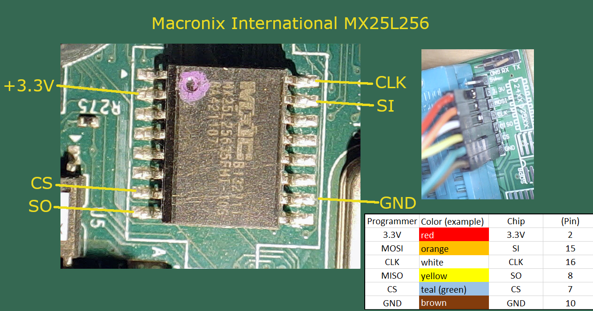
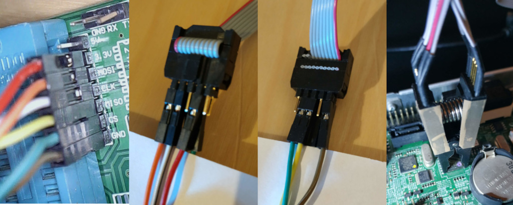
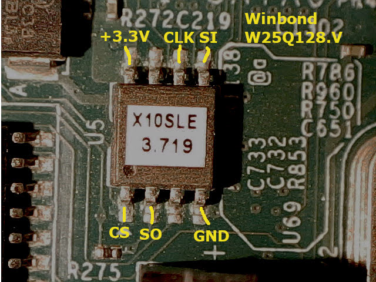
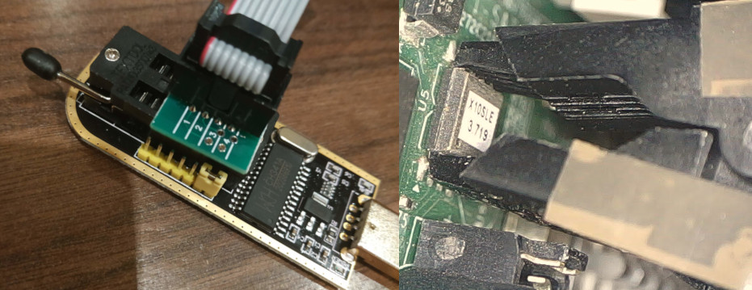

# How to flash the IC of the x10sle-f BIOS and BMC-Firmware

## Hardware requirements 

* At least one SPI programmer, preferrably a CH341A spi programmer, as this howto will base on that. 
* SOP8 Chip Grabber 
* SOP16 Chip Grabber 
* A few female to female dupont wire jumper cable 
* A fiber cleaning pin 
* a computer with linux (can be a Raspberry pi or similar types as well) 

If you like, you could probably get away with just an SPI programmer and a linux computer. 
(Heck, there is even the chance to use a [raspberry pi to flash via SPI](https://libreboot.org/docs/install/rpi_setup.html)!), but I would recommend to buy these chip grabbers while ordering the CH341A spi programmer, as they are very low cost and can help you in other situation with firmware/bios issue on notebooks, tablets and PCs also very well. 

### CH341A spi programmer
Lets start with the CH341A spi programmer:


As you can see, there are two different models on the market. You can choose what ever is available to you. They are sourceable from the typical online markets like Amazon, AliExpress and Ebay. If you need to know more about these CH341A programmer have a look at the [comprehensive overview at OneTransistor](https://www.onetransistor.eu/2017/08/ch341a-mini-programmer-schematic.html). 

### Chip grabber

The two firmware on the x10sle-f do have SOP8 and SOP16 IC layout. Therefore we need two different chip grabbers. If you look at the following photos, you will see that the SOP16 grabber is not fully wired. This is not a problem, as we only always need just the 1 or 2 pins from the edges. You could fiddle around and use the SOP16 grabber on a small SOP8 chip, but since these grabbers are super cheap, I would not recommend it. 

 

Please have a look at the red line of the ribbon cable. The is always pointing to the PIN1 of the IC. ICs have markings, like a dot or a  notch, to help finding PIN1. To make it more clear, I used little stickers on the side of the grabber to always ensure that I use the right direction. 

### Contact cleaning pen with fiber inert 

When I tried my first backups of the BMC firmware of the x10sle-f, I was constantly having issues to detect the flash chip. I figured out that the pins are either covered in a sealing or are just isolated by the years of use. 
That's why it is very helpful to get a contact cleaning pen with a fiber tip. The german translation is "Glasfaser Radierstift". 

They look like the following:


It is extremly helpful and I had no connectivity issues anymore. 


### Female dupont jumper wires

To ensure that you are able to wire the pins in the right order, you should have a few female to female dupont jumper wires at hand. All colorful cables in the document, which can be connected to pins are dupont jumper wires. Usually you get a few when you buy the spi programmer and chip-grabber. You will only need 6 of them. 

### Computer with linux

You can use whatever you have a hand: A notebook, desktop or embedded board like a raspberry pi, which is running linux. You *could* get away with a virtual machine, but I do not recommend it, as you have to communicate over USB and the timing needs to be exact. 
In this example I will use a linux machine running with Ubuntu 18.04. It is not very important to have exactly this version, since all tools I am using are pretty common in every linux distribution. 

## Physical connection to the firmware 

**WARNING! The SPI Programmer are set to power the Flash ICs themselfes. You have to pull off every other power supply to the Supermicro board! Otherwise you can harm your Supermicro Board, SPI Flasher and even your Computer which is connected via USB! You have been warned!**

### BMC flash pinout





Please ensure that the pins of the BMC flash chip is cleaned up with the cleaning pen to ensure good connectivity. Before plugging in the programmer into your USB board, make a check if GND on your programmer has a connection to the GND of the Supermicro Board. A good position is the Powersupply-Connector (which you have unplugged!) on the mainboard. 

Ensure that the "P/S" Jumper is set on your SPI Programmer. This one ensures that the programmer is able to power the flash chip.

If that works, you can give it a try and make a backup (see below) 


### BIOS flash pinout 





Please ensure that the pins of the BIOS flash chip is cleaned up with the cleaning pen to ensure good connectivity. Before plugging in the programmer into your USB board, make a check if GND on your programmer has a connection to the GND of the Supermicro Board. A good position is the Powersupply-Connector (which you have unplugged!) on the mainboard. 

Ensure that the "P/S" Jumper is set on your SPI Programmer. This one ensures that the programmer is able to power the flash chip.

If that works, you can give it a try and make a backup (see below) 


## Software Installation 

### Getting the newest flashrom version

There could be problems with old flashrom versions in linux distributions. That's why it is mandatory to get the latest source code of flashrom and build it. 

First ensure that you have no "flashrom" installed

```
user@mycomputer:~$ which flashrom 
user@mycomputer:~$
```
If you see a directory path which points to an existing flashrom binary, then please remove it first. 

Getting the new flashrom version:

This is a straight forward. If you are using Ubuntu Linux, it should work exactly as explained. On Debian or Redhat based distributions some libraries you be named differently. 

Ensuring that the apt sources are up to date. 
```
user@mycomputer:~$ sudo apt update
```

Installation everything to be able to compile C code and installing all required libraries and include files to work with usb programmers.
```
user@mycomputer:~$ sudo apt install git build-essential libpci-dev pciutils pciutils libpci-dev zlib1g-dev libusb-dev libusb-1.0.0-dev
```

Checking out flashrom, compiling it and installing it to /usr/local/sbin.
```
user@mycomputer:~$ git clone https://github.com/flashrom/flashrom.git
user@mycomputer:~$ cd flashrom 
user@mycomputer:~$ make 
```

When the compilation worked fine, continue with installing it to /usr/local/sbin 
```
user@mycomputer:~$ sudo make install
```

Let's see if flashrom is available now 

```
user@mycomputer:~$ which flashrom 
/usr/local/sbin/flashrom
user@mycomputer:~$
```
If it doesn't work, you may try it a root user, as the path is strictly for root/admin users. 


## Backup and Restore of the BMC Firmware 

If everything is connected as shown, try your luck with a backup of the BMC Firmware: 

```
user@mycomputer:~$ /usr/local/sbin/flashrom -p ch341a_spi -c MX25L25635F -r bmc_backup1.bin
```
If the chip is not detected, remove , try to unplug the programmer from usb, realign the grabber/clamp to ensure good fit and then plug in the programmer into USB again. 

You can also try to remove the ```-c MX25L25635F``` part to see if programmer detected a difference flash chip. 
You may be add ```-VV``` to the command above to have more verbose output. 

If you finally backed up the BMC firmware, redo the same with "bmc_backup2.bin" 
```
user@mycomputer:~$ /usr/local/sbin/flashrom -p ch341a_spi -c MX25L25635F -r bmc_backup2.bin
```

Then double check if both files are the same: 
```
user@mycomputer:~$ md5sum bmc_backup1.bin bmc_backup2.bin 
```
The checksum has to be the same, so that you can be sure that the transfer worked flawlessly. 

### Restoring

Restoring a already backed up file is very similar, but before you write something to the flash, I recommend to do a "test-backup" first. When the test backup worked fine, you can be sure that the connection works fine. 

The difference is "-w" which tells flashrom to **write** bmc_backup1.bin to the flash chip
```
user@mycomputer:~$ /usr/local/sbin/flashrom -p ch341a_spi -c MX25L25635F -w bmc_backup1.bin
```


## Backup and Restore of the BIOS Firmware 

If everything is connected as shown above, try your luck with a backup of the BIOS Firmware: 

The part of "-r bios_backup1.bin" means that flashrom will **read** from the flash-chip and writes that the bios_backup1.bin file. 
```
user@mycomputer:~$ /usr/local/sbin/flashrom -p ch341a_spi -c W25Q128.V -r bios_backup1.bin
```
If the chip is not detected, remove , try to unplug the programmer from usb, realign the grabber/clamp to ensure good fit and then plug in the programmer into USB again. 

You can also try to remove the ```-c W25Q128.V``` part to see if programmer detected a difference flash chip. 
You may be add ```-VV``` to the command above to have more verbose output. 

If you finally backed up the BMC firmware, redo the same with "bmc_backup2.bin" 
```
user@mycomputer:~$ /usr/local/sbin/flashrom -p ch341a_spi -c W25Q128.V -r bios_backup2.bin
```

Then double check if both files are the same: 
```
user@mycomputer:~$ md5sum bios_backup1.bin bios_backup2.bin 
```
The checksum has to be the same, so that you can be sure that the transfer worked flawlessly. 

### Restoring

Restoring a already backed up file is very similar, but before you write something to the flash, I recommend to do a "test-backup" first. When the test backup worked fine, you can be sure that the connection works fine. 

The difference is "-w" which tells flashrom to **write** bios_backup1.bin to the flash chip
```
user@mycomputer:~$ /usr/local/sbin/flashrom -p ch341a_spi -c W25Q128.V -w bios_backup1.bin
```


