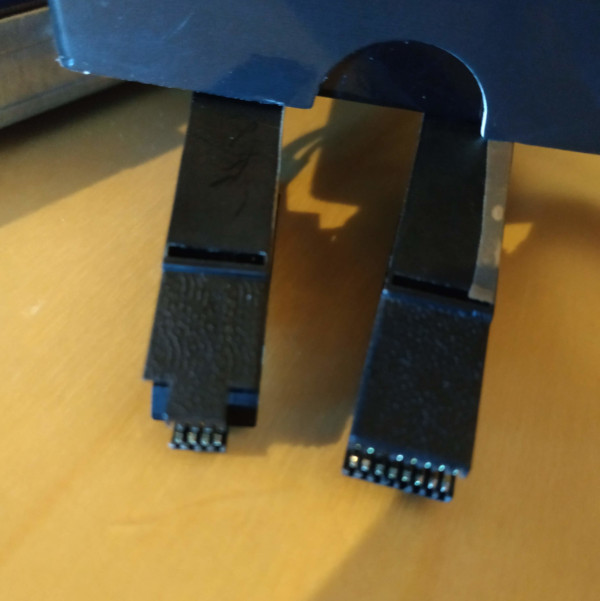

# How to flash the IC of the x10sle-f BIOS and BMC-Firmware

## Hardware requirements 

* At least one SPI programmer, preferrably a CH341A spi programmer, as this howto will base on that. 
* SOP8 Chip Grabber 
* SOP16 Chip Grabber 
* A few female to female dupont wire jumper cable 
* A fiber cleaning pin 
* a computer with linux (can be a Raspberry pi or similar types as well) 

If you like, you could probably get away with just an SPI programmer and a linux computer. 
(Heck, there is even the chance to use a [raspberry pi to flash via SPI](https://libreboot.org/docs/install/rpi_setup.html)!), but I would recommend to buy these chip grabbers while ordering the CH341A spi programmer, as they are very low cost and can help you in other situation with firmware/bios issue on notebooks, tablets and PCs also very well. 

### CH341A spi programmer
Lets start with the CH341A spi programmer:

As you can see, there are two different models on the market. You can choose what ever is available to you. They are sourceable from the typical online markets like Amazon, AliExpress and Ebay. If you need to know more about these CH341A programmer have a look at the [comprehensive overview at OneTransistor](https://www.onetransistor.eu/2017/08/ch341a-mini-programmer-schematic.html). 

### Chip grabber

The two firmware on the x10sle-f do have SOP8 and SOP16 IC layout. Therefore we need two different chip grabbers. If you look at the following photos, you will see that the SOP16 grabber is not fully wired. This is not a problem, as we only always need just the 1 or 2 pins from the edges. You could fiddle around and use the SOP16 grabber on a small SOP8 chip, but since these grabbers are super cheap, I would not recommend it. 

 

Please have a look at the red line of the ribbon cable. The is always pointing to the PIN1 of the IC. ICs have markings, like a dot or a  notch, to help finding PIN1. To make it more clear, I used little stickers on the side of the grabber to always ensure that I use the right direction. 

### Contact cleaning pen with fiber inert 

When I tried my first backups of the BMC firmware of the x10sle-f, I was constantly having issues to detect the flash chip. I figured out that the pins are either covered in a sealing or are just isolated by the years of use. 
That's why it is very helpful to get a contact cleaning pen with a fiber tip. The german translation is "Glasfaser Radierstift". 

They look like the following: 

It is extremly helpful and I had no connectivity issues anymore. 

### Female dupont jumper wires

To ensure that you are able to wire the pins in the right order, you should have a few female to female dupont jumper wires at hand. All colorful cables in the document, which can be connected to pins are dupont jumper wires. Usually you get a few when you buy the spi programmer and chip-grabber. You will only need 6 of them. 

### Computer with linux

You can use whatever you have a hand: A notebook, desktop or embedded board like a raspberry pi, which is running linux. You *could* get away with a virtual machine, but I do not recommend it, as you have to communicate over USB and the timing needs to be exact. 
In this example I will use a linux machine running with Ubuntu 18.04. It is not very important to have exactly this version, since all tools I am using are pretty common in every linux distribution. 

