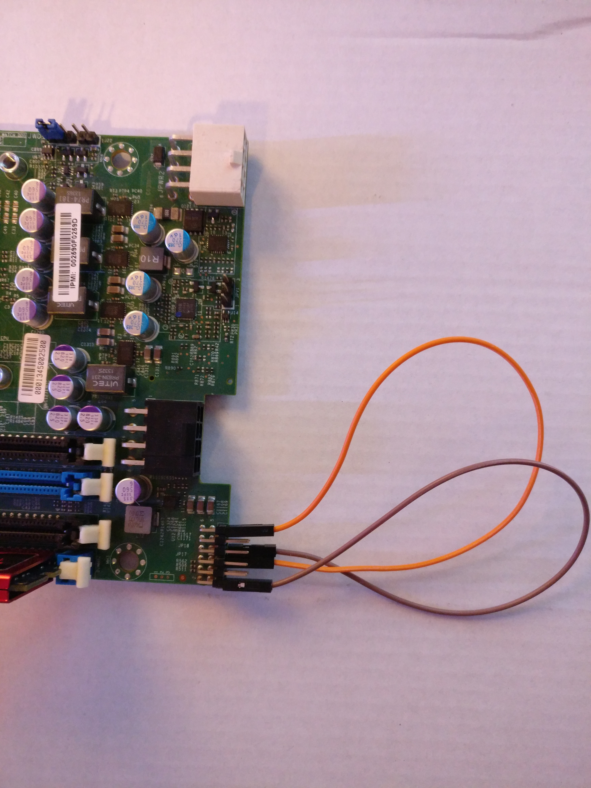
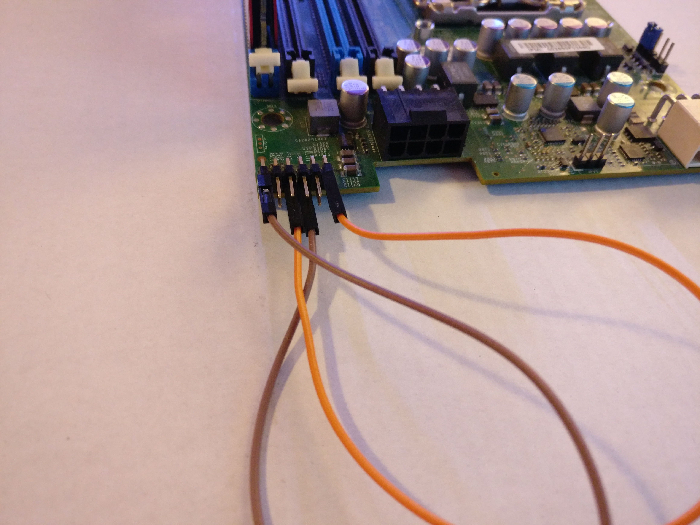

# Powering a Supermicro X10SLE-F without Chassis
## Jumping the logic
Following is a diagram showing the known pinout of the JPx connectors.   

Connect the pins like it is described in the table, and or visible in the following pictures.

This procedure is neccessary because the JPx Connectors are used for comunication and Hotplug detection with the Backplane.
Following are annotated pictures showing connections, voltages and expectations, as a base for this modification. 

Orange  = 3.3V

Red     = 5VSB

Yellow  = 12V

Black   = GND

White  and Green are just there to show a trace and annotate meaning to something. 

## Powering the Board
JPWR2 is the large white 8pin EPS used for powering the board. 
Its pinout is visible on the cables that come with the Blade, reuse of those is recommended. 
Yellow is as allways, 12V and the Purple line is 5V Stand-By.
5VSB is not visibly labled in the first annotated picture.  

